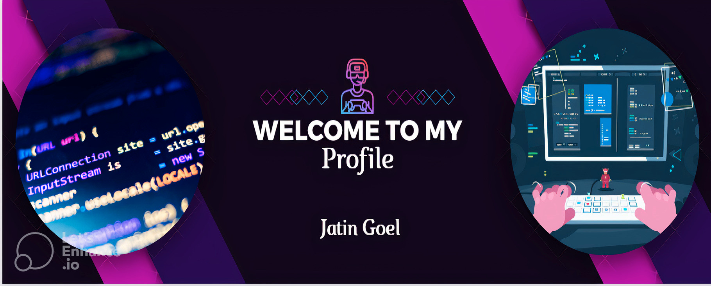

<h1 align="center">Hi 👋, I'm Jatin Goel</h1>
<h3 align="center">A passionate Data Analyst and Devops Engineer</h3>

  

- 🌱 I recently worked on...
  - Python_Diwali_Sales_Analysis
  - Loan Approval Prediction using Machine Learning
  - And working on other projects 

- 👯 I’m looking to collaborate on...
  - Open source Data Analyst projects
  - Devops projects for understanding concepts
  - Anything interesting and innovative!

- 💬 Ask me about...
  - Python programming
  - Data Analyst concpets and tools
  - Git and version control

## Skills

| Skill Category       | Technologies and Tools               |
|----------------------|--------------------------------------|
| Languages/Scripting  | Python, HTML, CSS                    |
| Database             | SQL , MySQL                          |
| Data Visualization   | Exploratory data analysis, Data Cleaning |
| Microsoft Tools      | Power BI, Excel                      |
| Cloud                | AWS, Microservices                   |
| Container            | Docker                               |
| Version Control      | Git                                  |

- 📫 How to reach me **jatin.goel0311@gmail.com**

⚡ Fun fact: I love talking about mysteries, and I'm a big fan of watching series and movies in my free time!
